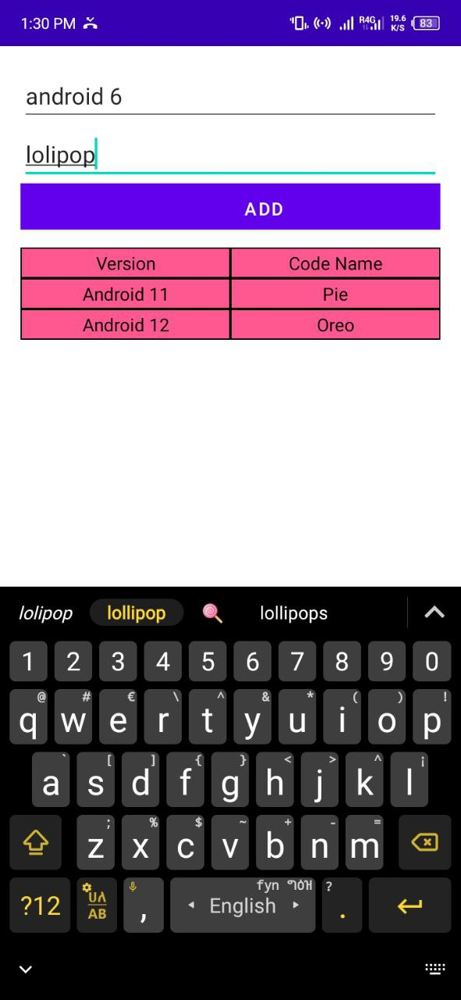

 
  
  &#xa0;

  <!-- <a href="https://tablelayout.netlify.app">Demo</a> -->

<h1 align="center">TableLayout</h1>

  <a href="#dart-about">About</a> &#xa0; | &#xa0; 
  <a href="#sparkles-features">Features</a> &#xa0; | &#xa0;
  <a href="#rocket-technologies">Technologies</a> &#xa0; | &#xa0;
  

 

  
  
   
    
     

<!-- 

 -->

The following tools were used in this project:

- [Kotlin](https://kotlin.com/)

Made with :heart 

&#xa0;

<a href="#top">Back to top</a>
